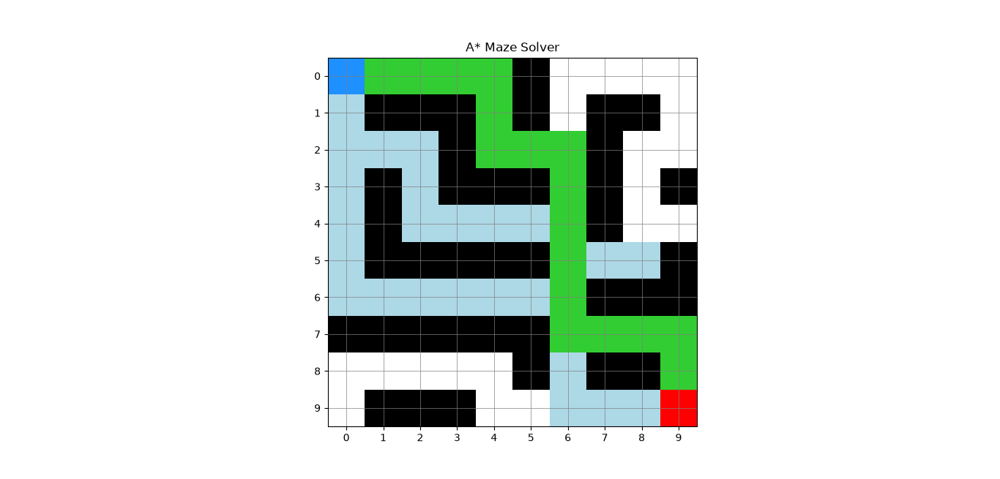

# A* Maze Solver

A Python implementation of the A* pathfinding algorithm that finds the shortest path through a grid-based maze.

## Features

- A* pathfinding algorithm
- Manhattan distance heuristic
- Shortest path reconstruction
- Explored node tracking
- Maze visualization using Matplotlib

## Result

Start: (0, 0)

Goal: (9, 9)

Explored Nodes: 43

Path Length: 18

## Maze Visualization

## Technologies Used

- Python
- A* Search Algorithm
- Matplotlib
- Git
- GitHub

## How to Run

Install the required dependencies:

pip install -r requirements.txt

Run the project:

python src/maze_solver.py

## Project Structure

Syntecxhub_A-Star-Maze-Solver/
├── screenshots/
│   └── astar_maze_result.png
├── src/
│   └── maze_solver.py
├── README.md
├── requirements.txt
└── .gitignore

## Author

Tushar G Anvekar